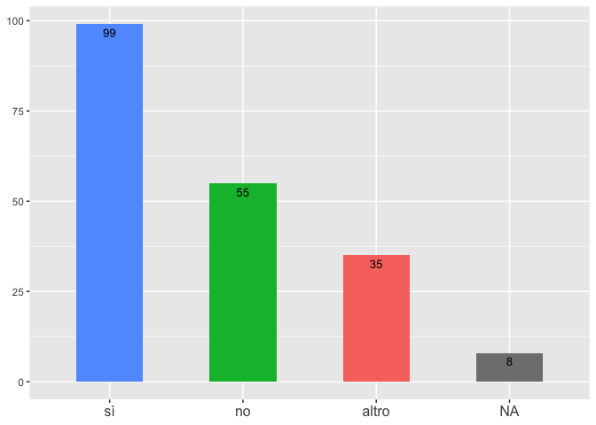

I-RIM Source Code
================
Giorgio Maria Di Nunzio
02/02/2021

# I-RIM Source Code

In this repository you can find the source code used to produce the
plots of the paper “Making an Opportunity out of a Crisis: The Inclusive
Approach of the Italian Robotics Community” submitted to the IEEE
Robotics & Automation Magazine [Special Issue on Robotics Response for
the COVID-19 Outbreak](https://ieeexplore.ieee.org/document/9113353)

## Run the code

First run the *analysis.R* file, then the *plot\_summary.R* file. You
will find the data in the *data\_ngram* folder while the plots in the
*plots* folder.

    ## 
    ## Attaching package: 'dplyr'

    ## The following objects are masked from 'package:stats':
    ## 
    ##     filter, lag

    ## The following objects are masked from 'package:base':
    ## 
    ##     intersect, setdiff, setequal, union

    ## [1] 4

    ## Note: Using an external vector in selections is ambiguous.
    ## ℹ Use `all_of(column)` instead of `column` to silence this message.
    ## ℹ See <https://tidyselect.r-lib.org/reference/faq-external-vector.html>.
    ## This message is displayed once per session.

    ## Warning: The `i` argument of ``[.tbl_df`()` must lie in [0, rows] if positive, as of tibble 3.0.0.
    ## Use `NA_integer_` as row index to obtain a row full of `NA` values.
    ## This warning is displayed once every 8 hours.
    ## Call `lifecycle::last_warnings()` to see where this warning was generated.

    ## New names:
    ## * n -> n...2
    ## * n -> n...4

    ## New names:
    ## * n -> n...6

    ## New names:
    ## * n -> n...8

    ## [1] 5

    ## New names:
    ## * n -> n...2
    ## * n -> n...4

    ## New names:
    ## * n -> n...6

    ## New names:
    ## * n -> n...8

    ## [1] 6

    ## New names:
    ## * n -> n...2
    ## * n -> n...4

    ## New names:
    ## * n -> n...6

    ## New names:
    ## * n -> n...8

    ## [1] 7

    ## New names:
    ## * n -> n...2
    ## * n -> n...4

    ## New names:
    ## * n -> n...6

    ## New names:
    ## * n -> n...8

    ## [1] 8

    ## New names:
    ## * n -> n...2
    ## * n -> n...4

    ## New names:
    ## * n -> n...6

    ## New names:
    ## * n -> n...8

    ## [1] 9

    ## New names:
    ## * n -> n...2
    ## * n -> n...4

    ## New names:
    ## * n -> n...6

    ## New names:
    ## * n -> n...8

    ## [1] 10

    ## New names:
    ## * n -> n...2
    ## * n -> n...4

    ## New names:
    ## * n -> n...6

    ## New names:
    ## * n -> n...8

    ## [1] 11

    ## New names:
    ## * n -> n...2
    ## * n -> n...4

    ## New names:
    ## * n -> n...6

    ## New names:
    ## * n -> n...8

    ## [1] 12

    ## New names:
    ## * n -> n...2
    ## * n -> n...4

    ## New names:
    ## * n -> n...6

    ## New names:
    ## * n -> n...8

    ## [1] 13

    ## New names:
    ## * n -> n...2
    ## * n -> n...4

    ## New names:
    ## * n -> n...6

    ## New names:
    ## * n -> n...8

    ## [1] 14

    ## New names:
    ## * n -> n...2
    ## * n -> n...4

    ## New names:
    ## * n -> n...6

    ## New names:
    ## * n -> n...8

    ## [1] 15

    ## New names:
    ## * n -> n...2
    ## * n -> n...4

    ## New names:
    ## * n -> n...6

    ## New names:
    ## * n -> n...8

    ## [1] 16

    ## New names:
    ## * n -> n...2
    ## * n -> n...4

    ## New names:
    ## * n -> n...6

    ## New names:
    ## * n -> n...8

    ## [1] 17

    ## New names:
    ## * n -> n...2
    ## * n -> n...4

    ## New names:
    ## * n -> n...6

    ## New names:
    ## * n -> n...8

    ## [1] 18

    ## New names:
    ## * n -> n...2
    ## * n -> n...4

    ## New names:
    ## * n -> n...6

    ## New names:
    ## * n -> n...8

    ## [1] 19

    ## New names:
    ## * n -> n...2
    ## * n -> n...4

    ## New names:
    ## * n -> n...6

    ## New names:
    ## * n -> n...8

    ## [1] 20

    ## New names:
    ## * n -> n...2
    ## * n -> n...4

    ## New names:
    ## * n -> n...6

    ## New names:
    ## * n -> n...8

    ## [1] 21

    ## New names:
    ## * n -> n...2
    ## * n -> n...4

    ## New names:
    ## * n -> n...6

    ## New names:
    ## * n -> n...8

    ## [1] 22

    ## New names:
    ## * n -> n...2
    ## * n -> n...4

    ## New names:
    ## * n -> n...6

    ## New names:
    ## * n -> n...8

    ## [1] 23

    ## New names:
    ## * n -> n...2
    ## * n -> n...4

    ## New names:
    ## * n -> n...6

    ## New names:
    ## * n -> n...8

    ## [1] 24

    ## New names:
    ## * n -> n...2
    ## * n -> n...4

    ## New names:
    ## * n -> n...6

    ## New names:
    ## * n -> n...8

    ## [1] 25

    ## New names:
    ## * n -> n...2
    ## * n -> n...4

    ## New names:
    ## * n -> n...6

    ## New names:
    ## * n -> n...8

    ## [1] 26

    ## New names:
    ## * n -> n...2
    ## * n -> n...4

    ## New names:
    ## * n -> n...6

    ## New names:
    ## * n -> n...8

    ## [1] 27

    ## New names:
    ## * n -> n...2
    ## * n -> n...4

    ## New names:
    ## * n -> n...6

    ## New names:
    ## * n -> n...8

    ## [1] 28

    ## New names:
    ## * n -> n...2
    ## * n -> n...4

    ## New names:
    ## * n -> n...6

    ## New names:
    ## * n -> n...8

    ## [1] 29

    ## New names:
    ## * n -> n...2
    ## * n -> n...4

    ## New names:
    ## * n -> n...6

    ## New names:
    ## * n -> n...8

    ## Downloading udpipe model from https://raw.githubusercontent.com/jwijffels/udpipe.models.ud.2.4/master/inst/udpipe-ud-2.4-190531/italian-isdt-ud-2.4-190531.udpipe to /Users/giorgiomariadinunzio/Documents/GitHub/I-RIM/italian-isdt-ud-2.4-190531.udpipe

    ## Visit https://github.com/jwijffels/udpipe.models.ud.2.4 for model license details

    ## Note: Using an external vector in selections is ambiguous.
    ## ℹ Use `all_of(dom_J)` instead of `dom_J` to silence this message.
    ## ℹ See <https://tidyselect.r-lib.org/reference/faq-external-vector.html>.
    ## This message is displayed once per session.

<!-- -->

    ## Saving 7 x 5 in image

    ## Saving 7 x 5 in image

    ## Note: Using an external vector in selections is ambiguous.
    ## ℹ Use `all_of(dom_K)` instead of `dom_K` to silence this message.
    ## ℹ See <https://tidyselect.r-lib.org/reference/faq-external-vector.html>.
    ## This message is displayed once per session.

<!-- -->

    ## Saving 7 x 5 in image

    ## Saving 7 x 5 in image

<!-- -->

    ## Saving 7 x 5 in image
    ## Saving 7 x 5 in image

    ## Note: Using an external vector in selections is ambiguous.
    ## ℹ Use `all_of(dom_L)` instead of `dom_L` to silence this message.
    ## ℹ See <https://tidyselect.r-lib.org/reference/faq-external-vector.html>.
    ## This message is displayed once per session.

<!-- -->

    ## Saving 7 x 5 in image

    ## Saving 7 x 5 in image

<!-- -->

    ## Saving 7 x 5 in image
    ## Saving 7 x 5 in image

    ## Note: Using an external vector in selections is ambiguous.
    ## ℹ Use `all_of(dom_I)` instead of `dom_I` to silence this message.
    ## ℹ See <https://tidyselect.r-lib.org/reference/faq-external-vector.html>.
    ## This message is displayed once per session.

<!-- -->

    ## Saving 7 x 5 in image

    ## Saving 7 x 5 in image

<!-- -->

    ## Saving 7 x 5 in image
    ## Saving 7 x 5 in image

    ## Note: Using an external vector in selections is ambiguous.
    ## ℹ Use `all_of(dom_V)` instead of `dom_V` to silence this message.
    ## ℹ See <https://tidyselect.r-lib.org/reference/faq-external-vector.html>.
    ## This message is displayed once per session.

<!-- -->

    ## Saving 7 x 5 in image

    ## Saving 7 x 5 in image

<!-- -->

    ## Saving 7 x 5 in image
    ## Saving 7 x 5 in image

    ## Note: Using an external vector in selections is ambiguous.
    ## ℹ Use `all_of(dom_W)` instead of `dom_W` to silence this message.
    ## ℹ See <https://tidyselect.r-lib.org/reference/faq-external-vector.html>.
    ## This message is displayed once per session.

<!-- -->

    ## Saving 7 x 5 in image

    ## Saving 7 x 5 in image

<!-- -->
